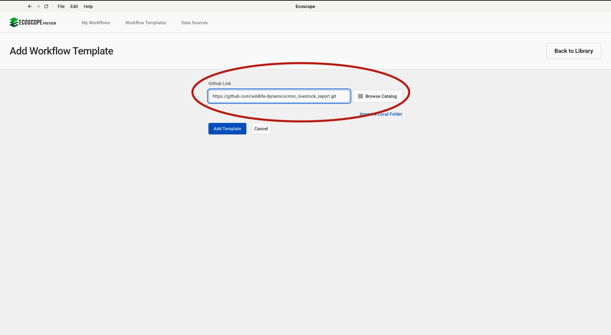
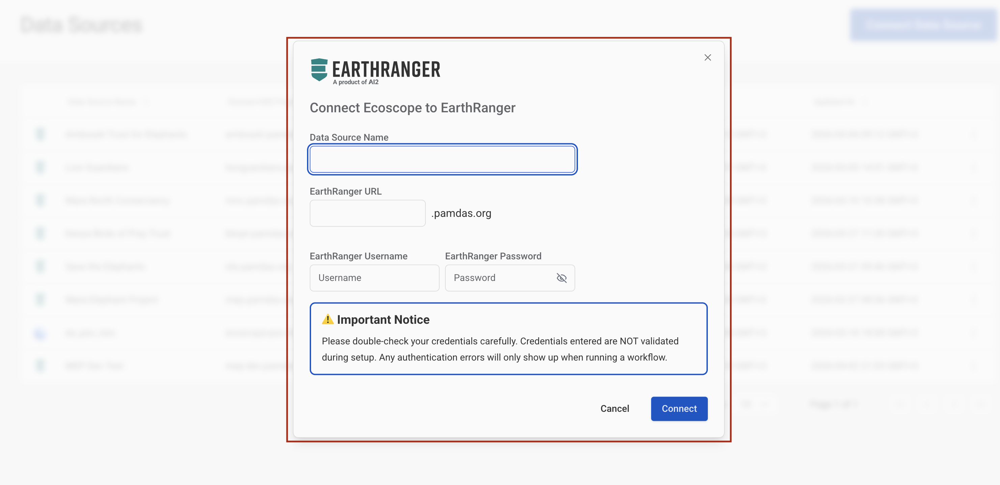
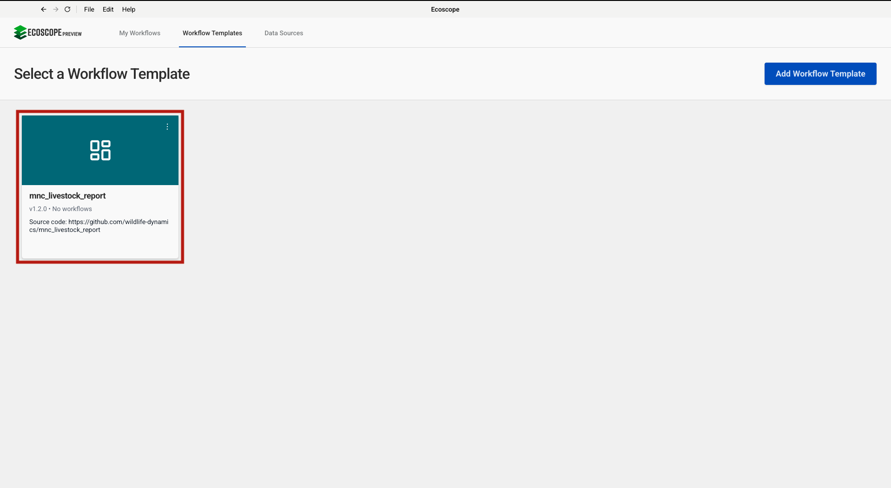
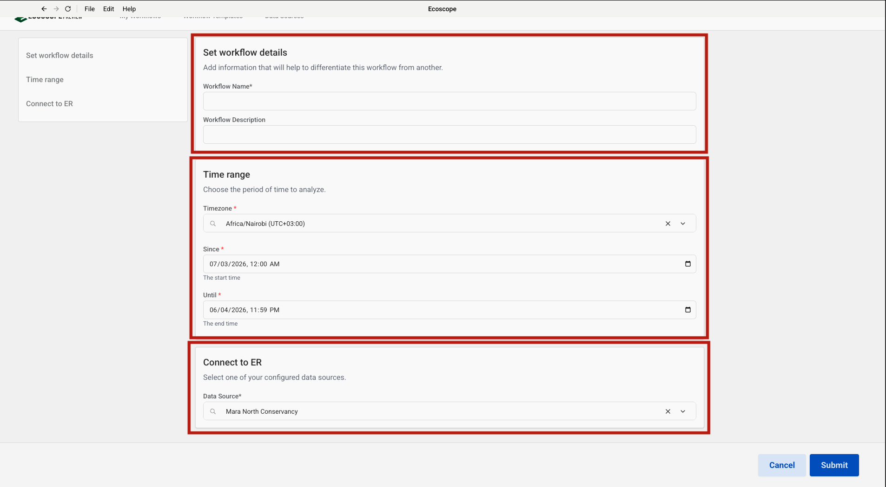

# MNC Livestock Report — User Guide

This guide walks you through configuring and running the MNC Livestock Report workflow, which processes mobile boma movement, cattle count, livestock predation, and illegal grazing events from EarthRanger to produce tabular CSV reports and interactive maps.

---

## Overview

The workflow delivers, for each run:

**CSV tables**
- **mobile_boma_movement_summary_table.csv** — daily count of mobile boma movement events with a grand total row
- **total_cattle_count_summary_table.csv** — cattle counts per grazing zone per date
- **livestock_predation_summary_table.csv** — records of livestock predation incidents by species, suspected predator, and number affected

**Maps (HTML + PNG)**
- **boma_movement_map** — point map of mobile boma locations on MNC grazing zones and parcels, coloured by event type
- **livestock_predation_events** — point map of predation incidents on conservancy boundaries, coloured by livestock species
- **illegal_grazing_map** — point map of illegal grazing incidents on MNC grazing zones, coloured by event type

---

## Prerequisites

Before running the workflow, ensure you have:

- Access to an **EarthRanger** instance with `mobile_boma_rep`, `cattle_count`, `livestock_predation_rep`, and `illegal_grazing_rep` events recorded for the analysis period
- Network access to **Dropbox** so the workflow can download the MNC conservancy boundary and parcels files at runtime

---

## Step-by-Step Configuration

### Step 1 — Add the Workflow Template

In the workflow runner, go to **Workflow Templates** and click **Add Workflow Template**. Paste the GitHub repository URL into the **Github Link** field:

```
https://github.com/wildlife-dynamics/mnc_livestock_report.git
```

Then click **Add Template**.



---

### Step 2 — Configure the EarthRanger Connection

Navigate to **Data Sources** and click **Connect**, then select **EarthRanger**. Fill in the connection form:

| Field | Description |
|-------|-------------|
| Data Source Name | A label to identify this connection (e.g. `Mara North Conservancy`) |
| EarthRanger URL | Your instance URL (e.g. `your-site.pamdas.org`) |
| EarthRanger Username | Your EarthRanger username |
| EarthRanger Password | Your EarthRanger password |

> Credentials are not validated at setup time. Any authentication errors will appear when the workflow runs.

Click **Connect** to save.



---

### Step 3 — Select the Workflow

After the template is added, it appears in the **Workflow Templates** list as **mnc_livestock_report**. Click the card to open the workflow configuration form.



---

### Step 4 — Configure Workflow Details, Time Range, and EarthRanger Connection

The configuration form has three sections on a single page.

**Set workflow details**

| Field | Description |
|-------|-------------|
| Workflow Name | A short name to identify this run |
| Workflow Description | Optional notes (e.g. reporting month or site) |

**Time range**

| Field | Description |
|-------|-------------|
| Timezone | Select the local timezone (e.g. `Africa/Nairobi UTC+03:00`) |
| Since | Start date and time — all livestock events from this point are fetched |
| Until | End date and time of the analysis window |

**Connect to ER**

Select the EarthRanger data source configured in Step 2 from the **Data Source** dropdown (e.g. `Mara North Conservancy`).

Once all three sections are filled, click **Submit**.



---

## Running the Workflow

Once submitted, the runner will:

1. Download the MNC community conservancy boundary and parcels files from Dropbox and prepare all geospatial map layers (grazing zones, conservancy boundaries, parcels, and text labels).
2. Fetch `mobile_boma_rep`, `cattle_count`, `livestock_predation_rep`, and `illegal_grazing_rep` events for the analysis period from EarthRanger; extract the date from each event's timestamp; add a temporal index.
3. **Mobile Boma branch** — filter `mobile_boma_rep` events; process and flatten event details; retain key fields (date, location, zone, boma status, relocation reason); compute daily boma event counts with a grand total row; save as `mobile_boma_movement_summary_table.csv`; produce a point map saved as `boma_movement_map.html` and `.png`.
4. **Cattle Count branch** — filter `cattle_count` events; process and flatten event details; retain cattle counts per zone (Zone 1, Zone 2/3, Zone 4) and total; save as `total_cattle_count_summary_table.csv`.
5. **Livestock Predation branch** — filter `livestock_predation_rep` events; process and flatten event details; produce a point map saved as `livestock_predation_events.html` and `.png`; save a summary table with species, suspected predator, and animals affected as `livestock_predation_summary_table.csv`.
6. **Illegal Grazing branch** — filter `illegal_grazing_rep` events; process and flatten event details; retain herd zone, landowner, and action taken; produce a point map saved as `illegal_grazing_map.html` and `.png`.
7. Save all outputs to the directory specified by `ECOSCOPE_WORKFLOWS_RESULTS`.

---

## Output Files

All outputs are written to `$ECOSCOPE_WORKFLOWS_RESULTS/`.

### CSV Tables

| File | Description |
|------|-------------|
| `mobile_boma_movement_summary_table.csv` | Daily boma event count (date, boma_events) with a grand Total row |
| `total_cattle_count_summary_table.csv` | Cattle counts per date by zone (zone_1, zone_2_3, zone_4, total_count) |
| `livestock_predation_summary_table.csv` | Predation records: date, livestock species, suspected predator, total animals affected |

### Maps

| File | Description |
|------|-------------|
| `boma_movement_map.html` / `.png` | Mobile boma locations on MNC grazing zones and parcels, coloured by event type |
| `livestock_predation_events.html` / `.png` | Predation incident locations on conservancy boundaries, coloured by livestock species |
| `illegal_grazing_map.html` / `.png` | Illegal grazing locations on MNC grazing zones, coloured by event type |
