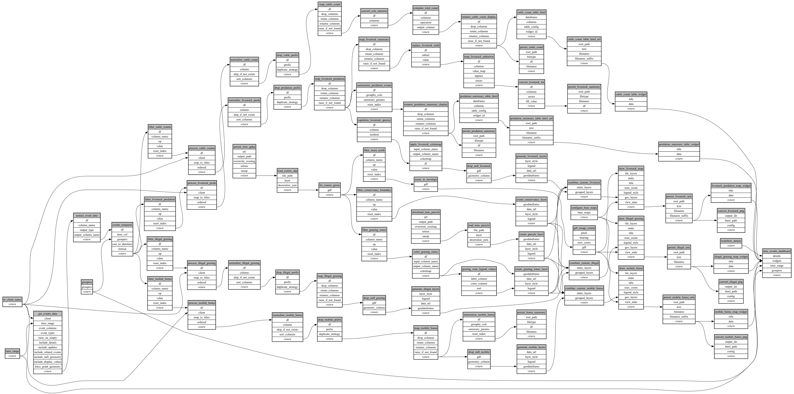

```
# AUTOGENERATED BY ECOSCOPE-WORKFLOWS; see fingerprint in README.md for details

```

```yaml
# fingerprint:
artifacts_sha256_basic: 6ba387add67fbcbef194d6a4d9c77af4aaa97c6fdbe3e439a9438c0072b35aea
artifacts_sha256_strict: 4707086583be54af6be8eed81bb61c5038ee142f229b8f0cbedb08f0b3f983e8
installed_requirements:
- channel: https://repo.prefix.dev/ecoscope-workflows/
  name: ecoscope-platform
  version: {version: ==2.15.1}
- channel: https://repo.prefix.dev/ecoscope-workflows-custom/
  name: ecoscope-workflows-ext-custom
  version: {version: ==0.1.0rc14}
- channel: https://repo.prefix.dev/ecoscope-workflows-custom/
  name: ecoscope-workflows-ext-ste
  version: {version: ==0.0.0rc1}
- channel: https://repo.prefix.dev/ecoscope-workflows-custom/
  name: ecoscope-workflows-ext-mnc
  version: {version: ==1.0.0}
- channel: conda-forge
  name: pydeck
  version: {version: ==0.9.2}
- channel: conda-forge
  name: opentelemetry-sdk
  version: {version: ==1.44.0}
params_sha256: 8ec66f689124f09fdc0b9e58fd0668d6d6a9a023df19834cdf059202d17289b4
spec_sha256: cfdf5461b06b2e90fd160c58e7b392f0128d92fb81d5a7e22fc6b08012b1c296

```

# ecoscope-workflows-livestock-monitoring-workflow


