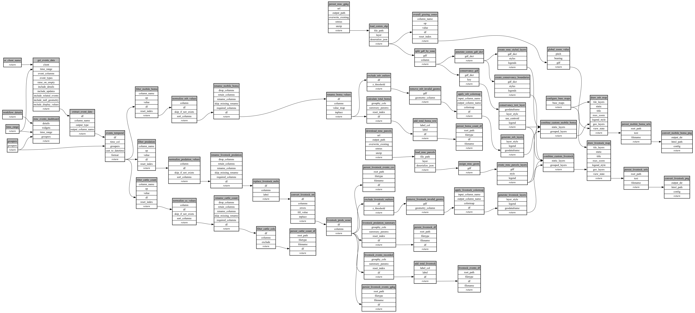

```
# AUTOGENERATED BY ECOSCOPE-WORKFLOWS; see fingerprint in README.md for details

```

```yaml
# fingerprint:
artifacts_sha256_basic: 7477b68bc19a894601cbb6d53f04c312752291fa809b6e874db7250cfdd1abab
artifacts_sha256_strict: 7456a87a6722a0f23252a4fd4488ae7141943e1500125dfe1a7c29e22603df5a
installed_requirements:
- channel: https://repo.prefix.dev/ecoscope-workflows/
  name: ecoscope-workflows-core
  version: {version: ==0.22.18}
- channel: https://repo.prefix.dev/ecoscope-workflows/
  name: ecoscope-workflows-ext-ecoscope
  version: {version: ==0.22.18}
- channel: https://repo.prefix.dev/ecoscope-workflows-custom/
  name: ecoscope-workflows-ext-custom
  version: {version: ==0.0.39}
- channel: https://repo.prefix.dev/ecoscope-workflows-custom/
  name: ecoscope-workflows-ext-ste
  version: {version: ==0.0.13}
- channel: https://repo.prefix.dev/ecoscope-workflows-custom/
  name: ecoscope-workflows-ext-mnc
  version: {version: ==0.0.8}
params_sha256: 3ab4c0f59c459fe3feea277da14ef6a8b3d0dfc0f958f3f015ddd4d700bcc5f8
spec_sha256: 363d82416b04e1a07d5c29db1a16cc8ce451babcc822f4935a650dc6b9c1f143

```

# ecoscope-workflows-mnc-livestock-report-workflow


